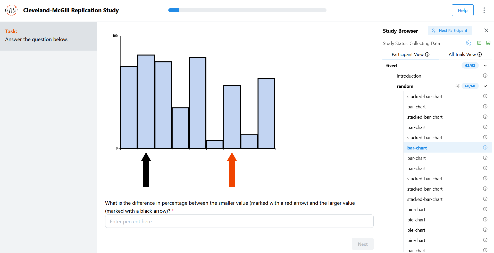
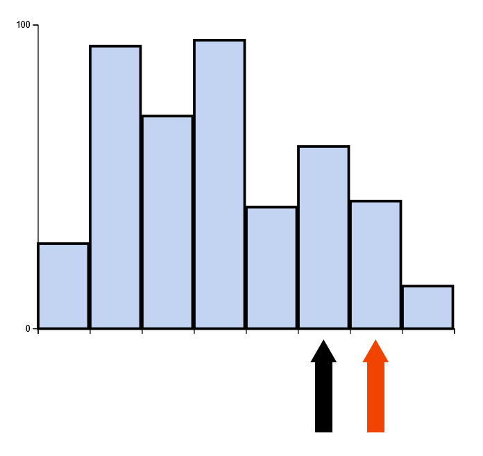
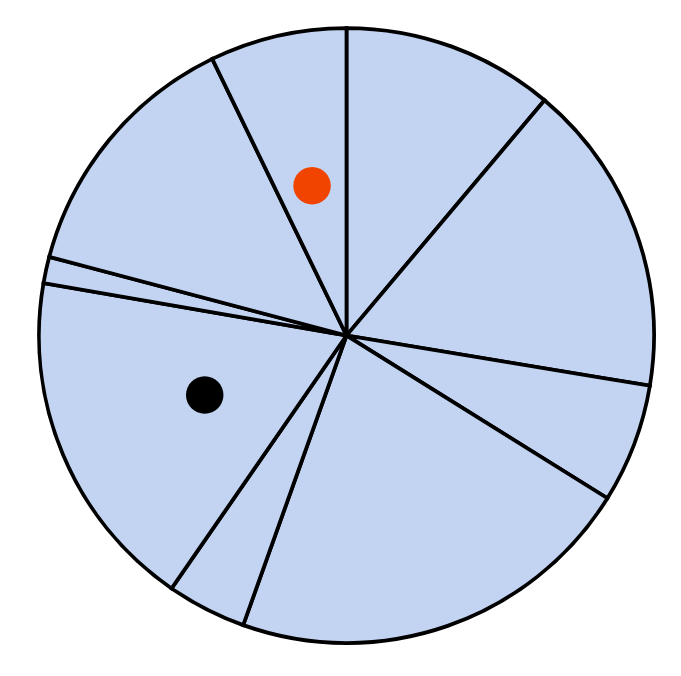
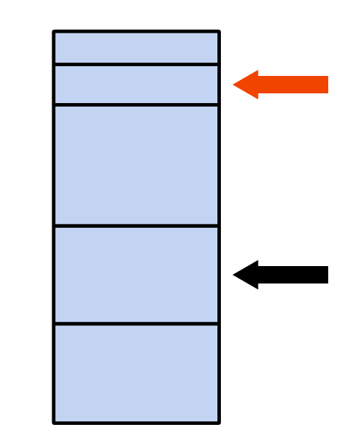

# Cleveland-McGill Replication Study

prey. i am prey. and git is my hunter. the most frustrating gam

## Github pages link
https://gabrielolafs.githu.io/a3-experiment-revisit/

## Description
For our study, we replicated the 1984 Cleveland-McGill study on comparing how intuitive different types of charts are to comprehend and analyze. The visualizations we chose to test are bar charts, pie charts, and stacked bar charts. We chose these types of charts because they all have the similar purpose of comparing the numerical values of different categories, yet each of them represent the same data in their own ways. With our replication study, we aim to have users estimate the different in percentage between two values on each type of chart to test which of these three is the best choice for making a readable graph.

## Charts in our Study

### Experiment view

### Bar chart example

### Pie chart example

### Stacked bar chart example

## Technical Achievements
- **Object-Oriented Data Storage**: Since the answers to each question is generated upon the user reaching said question, we needed a way to store not only the user's answer, but the data points that were selected and the percentage different of the smaller and larger value. To store all this data at once upon submission, we submit each answered question as an object with these values as attributes.
- **Wrote Vega Number Line Creation Code for MSZ Team**: Zach is part of the MQP that everyone on the MSZ team is on, and he developed a script that will take in some parameters in a JSON object in the form of a grammar and create a number line in Vega from it. Although it's for another project, this code made the process of developing number line visualizations to test a lot smoother for that team, as creating number lines from scratch in Vega or D3 would be a lot more time-consuming otherwise.

## Design Achievements
- **Arrows Pointing to Data**: The examples for bar charts in the Cleveland-McGill study have the two values that the question is asking about indicated with small circles on the relevant bars. While we felt this worked for the pie charts, we found that having arrows pointing to the relevant bars of the bar charts and stacked bar charts makes the question take even less time to process. We also made the smaller arrow red and the larger arrow black to assist in visualizing what the question is asking even more. While applying unique colors to the bars for comparison would make the task for our test too easy, applying colors to these arrows still grabs the user's attention the same way and points right to what's relevant without affecting the reliability of the study.
- **Ergonomic Design**: We originally had our questions in the sidebar, as it nicely separates the question from the visualization into their own sections. However, we noticed that as each person answers 60 questions, having to drag your mouse between the sidebar on the left and the next button on the right that many times in succession can be straining. To remedy this, we changed the position of the questions to be below the visualizations so that the mouse movement between the text box and the next button is minimal. The size of each visualization was also adjusted to fit its section exactly so that the user doesn't need to move the mouse up to scroll down large charts, nor do they have to strain their eyes from reading charts that are too small.
